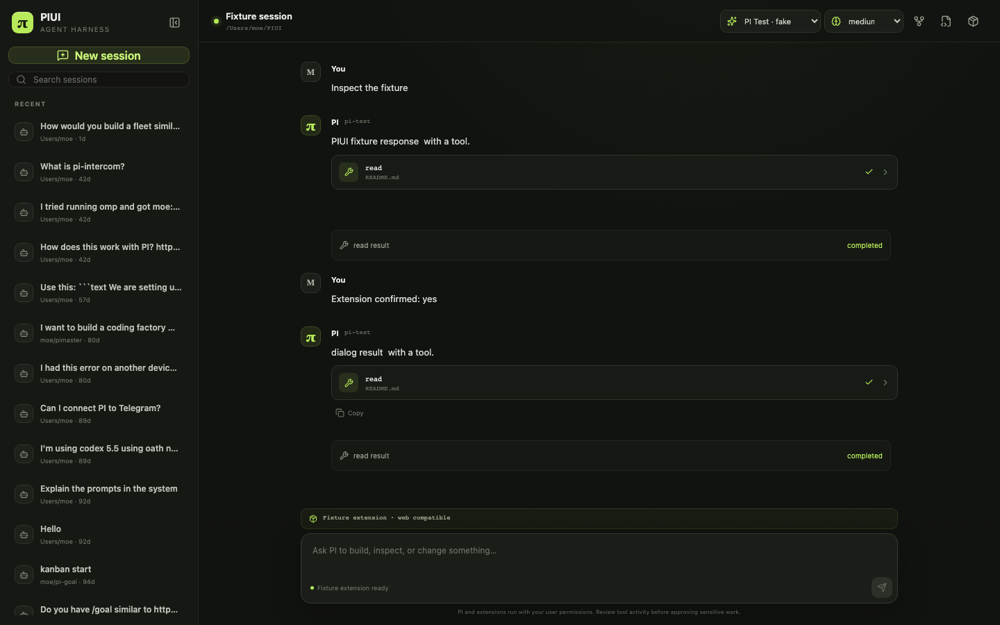

# PIUI

PIUI is a local-first web UI harness for the [PI coding agent](https://github.com/earendil-works/pi). It takes the core product ideas from [DeepSeek Harness](https://github.com/deepseek-ai/deepseek-harness)—workspace sessions, streamed agent chat, tools, models, and an extensible runtime—and maps DeepSeek “plugins” to PI's native **extensions**.



## What works

- Persistent PI sessions: create, resume, search, rename, and clone
- Streaming text and reasoning, Markdown, images, tool calls, and tool results
- Steer and follow-up queues, plus abort
- Model and thinking-level selection using your existing PI configuration
- Slash-command discovery for extensions, skills, and prompt templates
- PI extension UI over RPC: select, confirm, input, editor, notifications, status, text widgets, title, and editor-text updates
- Read-only extension inventory, including packages and top-level extension files
- Explicit project trust before PI loads project-local extensions

PIUI deliberately uses PI's documented RPC mode. It does not scrape the terminal UI or recreate DeepSeek Harness's Cordis framework.

## Requirements

- Node.js 22.19 or newer
- PI 0.84.1-compatible local configuration and provider authentication

PIUI pins the matching PI runtime package so a clone uses a known protocol version. It still reads your existing `~/.pi/agent` settings, sessions, extensions, and authentication on the server side. Credentials are never sent to the browser.

## Run

On macOS, you can double-click **Start PIUI.command** in the project folder. PIUI builds, starts its local server, and opens the interface in your browser.

Do not open `index.html` directly: the `file://` page cannot connect to the PI server process.

Or start it from a terminal:

```bash
npm install
npm run build
npm start
```

PIUI binds to `http://127.0.0.1:31415` and opens it in your browser. To keep it from opening automatically:

```bash
npm start -- --no-open
```

Options:

```text
--cwd <path>       Initial workspace (defaults to current directory)
--port <number>    Server port (default: 31415)
--host <address>   Bind address (default: 127.0.0.1)
--no-open          Do not open the browser
```

For development, run `npm run dev`; Vite proxies `/api` and WebSocket traffic to the local PIUI server.

## Extension compatibility

PI extensions are the equivalent of DeepSeek Harness plugins. Their agent-facing behavior—tools, events, commands, provider hooks, session state—runs normally inside PI.

PI's RPC mode supports generic web rendering for:

- `select`, `confirm`, `input`, and `editor`
- `notify`, `setStatus`, `setWidget` with string lines, `setTitle`, and `setEditorText`

Terminal-only presentation cannot be transported through the standard PI RPC protocol. `ctx.ui.custom()`, component widgets, custom headers/footers/editors, theme control, raw terminal input, and custom TUI renderers are unavailable. PIUI states this limitation in the Extensions panel instead of pretending those controls are supported.

## Security model

PI is not a sandbox. PI tools and extensions run with the permissions of the user who started PIUI.

PIUI therefore:

- binds to loopback by default
- validates HTTP host, WebSocket origin, and a same-site HTTP-only session cookie
- requires an explicit trust choice before loading project-local PI resources
- spawns PI with an argument array, never through a shell
- restricts session resume paths to PI's configured session directory
- never exposes environment credentials or PI auth files to the browser

“Start without project extensions” passes `--no-approve`; user-level extensions still load. “Trust & start” passes `--approve` for that PI process.

## Architecture

```text
Browser (React)
  └─ same-origin WebSocket
      └─ PIUI loopback server
          └─ child process: node pi/dist/cli.js --mode rpc
              ├─ ~/.pi/agent settings and auth
              ├─ PI session JSONL
              └─ PI extensions
```

The server parses PI's strict LF-delimited JSONL protocol, correlates command responses, forwards live events, and routes extension UI responses back to the requesting extension. `message_end` is authoritative for final assistant content, and `agent_settled` marks true completion after retries, compaction, and queued work.

## Verify

```bash
npm run check
npm test
npm run build
npm run test:e2e
```

`npm run test:real` runs an opt-in smoke against the installed/authenticated PI runtime. The default test suite uses a deterministic fake RPC process and does not spend model tokens.

## Upstream references

- DeepSeek Harness commit analyzed: `47f943859bef60e4160492346772ded9b24f765a`
- PI commit analyzed: `6f707eb36064e82af9c1320a7634f4dfad21049b`
- PI runtime protocol: 0.84.1

Both upstream projects are MIT-licensed. PIUI is an independent interface and does not copy DeepSeek Harness source code.

## License

MIT
