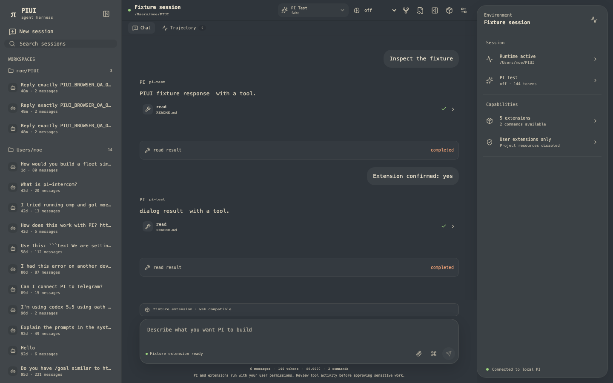
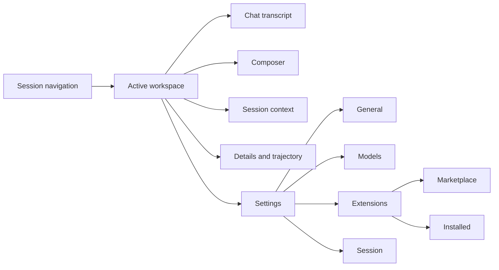
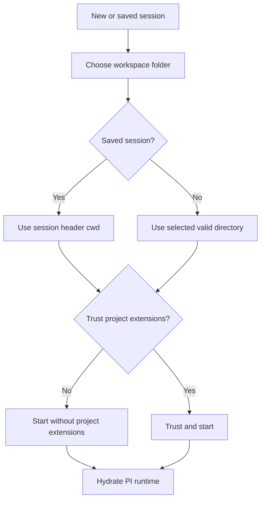
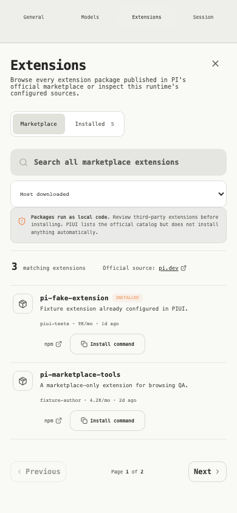

# PIUI Design Specification

Status: implemented source of truth  
Last reviewed: 2026-08-15  
Applies to: PIUI `0.1.x`  
Primary implementation: `src/App.tsx`, `src/components.tsx`, `src/surfaces.tsx`, and `src/styles.css`

## 1. Product definition

PIUI is a local-first web interface for the PI coding agent. It gives PI's process, session, model, tool, and extension APIs a durable graphical workspace without scraping or reproducing PI's terminal UI.

The interface combines three influences:

1. PI supplies the runtime contract: sessions, messages, tools, models, thinking levels, extensions, and RPC events.
2. DeepSeek Harness supplies the product scope: a session browser, streamed conversation, trajectory inspection, settings, and an extensible UI host.
3. Codex supplies the visual direction: a quiet desktop workbench, narrow reading column, warm graphite palette, compact monospace typography, rounded composer, and contextual information that stays secondary to the conversation.

PIUI is inspired by Codex's hierarchy and interaction density. It is not a visual clone and does not reuse Codex assets, names, or private components.



## 2. Product goals

The design must make these jobs feel direct and trustworthy:

- start PI in a chosen workspace with an explicit project-extension trust decision;
- resume and search persistent PI sessions;
- type, attach images, send, steer, follow up, and abort without leaving the main surface;
- read streamed assistant text, reasoning, tool calls, tool results, and errors in one chronological transcript;
- see the active model, thinking level, context, cost, runtime, and extension state;
- inspect the durable PI session trajectory when more detail is needed;
- browse the complete official PI extension marketplace separately from locally configured extensions;
- render the standard extension UI contract faithfully in the browser;
- survive reloads and reconnects without losing or duplicating the visible session state.

## 3. Non-goals

PIUI does not:

- recreate PI's terminal chrome or arbitrary TUI components;
- claim to sandbox PI, tools, or extensions;
- show unauthenticated models as if they were selectable;
- silently trust project extensions;
- install marketplace packages automatically;
- mutate global PI settings merely to populate a catalog;
- reproduce DeepSeek Harness's internal Cordis plugin framework;
- add decorative dashboards that compete with the current conversation.

## 4. Design principles

### 4.1 Conversation first

The transcript and composer are the primary work surface. Navigation, metadata, settings, and trajectory are nearby but visually quieter. The desktop reading column is capped at `750px` so long messages remain readable.

### 4.2 State must be honest

Every control reflects the actual PI runtime. A control that requires hydrated PI state is disabled until the runtime is ready. “Configured,” “installed,” “trusted,” “starting,” and “active” are distinct labels and must not be used interchangeably.

### 4.3 Progressive disclosure

The default view shows the session title, model, thinking level, transcript, and composer. Raw entries, token details, queues, compatibility warnings, and package provenance live in details or settings surfaces.

### 4.4 Locality is visible

Workspace paths, runtime connection state, trust state, and package provenance remain visible because PI can read files and execute commands with the user's permissions.

### 4.5 Quiet density

PIUI uses compact controls and low-contrast boundaries, but interactive targets must remain comfortable. Search fields are `44px` high, primary controls are generally `39–45px`, and icon-only actions are at least `32px` square.

### 4.6 Responsive capability, not scaled desktop

At narrower widths, secondary regions collapse and actions reflow. The transcript and composer retain priority; no essential action may sit outside the viewport.

## 5. Information architecture



The desktop shell has three regions:

| Region | Width | Purpose |
| --- | ---: | --- |
| Session sidebar | `286px` | Brand, new session, search, workspace grouping, session history |
| Workspace | Flexible | Header, Chat/Trajectory navigation, transcript, composer |
| Context rail | `320px` | Runtime, model, token, extension, command, and trust summaries |

The workspace grid uses four rows:

1. `49px` top bar;
2. `34px` view navigation;
3. flexible transcript;
4. intrinsic composer area.

## 6. Visual language

### 6.1 Character

The interface should feel like a focused local development tool: calm, technical, warm, and slightly tactile. It should not feel like an analytics dashboard, consumer messenger, or neon terminal theme.

Preferred qualities:

- graphite surfaces rather than absolute black;
- warm neutral text rather than blue-white text;
- orange for deliberate actions and selected states;
- green only for healthy runtime and successful execution;
- subtle separators rather than boxed cards everywhere;
- rounded, elevated composer and context rail against flatter navigation.

### 6.2 Core color tokens

Dark/system-dark:

| Token | Value | Use |
| --- | --- | --- |
| `--bg` | `#2f353b` | Workspace canvas |
| `--sidebar` | `#41464a` | Session navigation |
| `--surface` | `#383e43` | Composer and controls |
| `--surface-2` | `#3f454a` | Hover and secondary surfaces |
| `--surface-3` | `#484e52` | Active controls |
| `--text` | `#e5ddca` | Primary text |
| `--text-soft` | `#d0c7b1` | Message and control text |
| `--muted` | `#c2baa7` | Secondary labels |
| `--dim` | `#bbb4a3` | Metadata and tertiary labels |
| `--orange` | `#f08a52` | Action emphasis |
| success | `#9bd27c` | Connected, completed, successful |
| `--red` | `#d97d7d` | Abort, error, destructive state |

Light/system-light:

| Token | Value | Use |
| --- | --- | --- |
| `--bg` | `#f5f5f2` | Workspace canvas |
| `--sidebar` | `#e9e9e5` | Session navigation |
| `--surface` | `#ffffff` | Composer and controls |
| `--surface-2` | `#ecece8` | Hover and secondary surfaces |
| `--surface-3` | `#e2e2dd` | Active controls |
| `--text` | `#252625` | Primary text |
| `--text-soft` | `#383936` | Message and control text |
| `--muted` | `#555751` | Secondary labels |
| `--dim` | `#62645e` | Metadata and tertiary labels |
| selected/action | `#a44b22` | Accessible warm accent |

Semantic color must never be the only state indicator. Color is paired with text, an icon, a disabled state, or an `aria-*` attribute.

### 6.3 Typography

The primary family is the platform monospace stack:

```css
ui-monospace, "SFMono-Regular", "SF Mono", Menlo, Monaco, Consolas, monospace
```

The typography hierarchy is intentionally compact:

| Role | Typical size | Weight | Notes |
| --- | ---: | ---: | --- |
| Empty-state title | `22–29px` | `520` | Tight tracking, sentence case |
| Dialog title | `22–24px` | default/medium | One title per surface |
| Brand | `15px` | `540` | Paired with small descriptor |
| Message body | `13px` | normal | `1.72` line height |
| Primary control | `10–12px` | `450–600` | Prefer concise labels |
| Metadata | `8–10px` | normal | Must retain accessible contrast |
| Section label | `10px` | `500` | Small letter spacing, not heavy uppercase |

Use sentence case for interface labels. Uppercase is reserved for short technical eyebrows or source labels.

### 6.4 Spacing and shape

The practical spacing scale is `4, 8, 12, 16, 24, 32px`. Deviations are allowed for optical alignment, not arbitrary variation.

- general control radius: `8–10px`;
- general panel radius: `12–16px`;
- composer radius: `20px` desktop, `18px` mobile;
- context rail radius: `22px`;
- circular send/stop buttons: `999px`;
- message rhythm: approximately `28px` between messages;
- modal edge clearance: at least `16px` on desktop and full-screen on mobile where specified.

Borders use `--line` for meaningful boundaries and `--line-soft` for grouping. Hover states usually use a translucent fill instead of a stronger border.

### 6.5 Icons

PIUI uses Lucide icons. Icons clarify actions but do not replace accessible names.

- default icon size: `13–17px`;
- icon-only buttons: `32px` square with `aria-label` and usually `title`;
- do not mix filled illustrative icon families with Lucide;
- use the π mark only for PIUI identity and the empty state;
- animation is limited to progress, loading, and runtime activity.

## 7. Shell components

### 7.1 Session sidebar

The sidebar contains:

1. PIUI identity and collapse control;
2. New session action;
3. `44px` session search;
4. workspace groups;
5. session rows with title, relative timestamp, and message count.

Rules:

- group sessions by their authoritative `cwd`;
- cap the rendered filtered result set at 80 sessions;
- truncate long paths and titles instead of expanding the sidebar;
- use a quiet filled state for the current session;
- show “No matching sessions” when search has no results;
- when collapsed, preserve a visible sidebar-open rail.

### 7.2 Top bar

The top bar exposes the minimum global state needed during work:

- runtime health;
- session name and workspace;
- active model and provider;
- thinking level;
- clone, rename, details, extensions, and settings actions.

Runtime health states:

| State | Indicator | Supporting copy |
| --- | --- | --- |
| Ready | Green dot | Workspace path and active model |
| Starting/hydrating | Orange animated dot | “Starting PI…” |
| Stopped | Neutral dot | “Runtime stopped” |
| Disconnected | Persistent banner | “Reconnecting to PIUI…” |

Model, thinking, clone, and rename controls remain disabled until the runtime is hydrated.

### 7.3 View navigation

Chat is the active persistent view. Trajectory opens the details surface and shows the current entry count. The navigation is intentionally shallow; do not create inactive destinations merely to mimic a larger application.

### 7.4 Context rail

The context rail is a compact environment summary, not a second settings panel. It contains:

- session/runtime status and workspace;
- active model, thinking level, and token count;
- configured extension and command counts;
- project trust state;
- local PI connection state.

Each row opens the relevant details or extensions surface. The rail disappears below `1280px`; all of its information remains reachable elsewhere.

## 8. Conversation design

### 8.1 Transcript

The transcript is a chronological projection of PI messages and events.

- Assistant content uses the full `750px` reading width.
- User messages are right-aligned bubbles capped at `58%` desktop and `85%` mobile.
- Avatars are hidden in the Codex-inspired language to reduce visual noise.
- Assistant metadata shows role and relevant model/time details.
- The viewport follows active streaming but must not prevent the user from reading earlier content.

### 8.2 Markdown

Supported presentation includes paragraphs, headings, lists, links, blockquotes, tables, fenced code, inline code, and images.

- body copy is `13px / 1.72`;
- code uses an inset dark surface and scrolls rather than wrapping destructively;
- links use the warm accent and remain visually distinguishable;
- remotely referenced content must not weaken the app's content security policy.

### 8.3 Reasoning

Thinking content is visually subordinate and disclosed progressively. It must never be confused with the assistant's final answer.

### 8.4 Tools

Tool activity appears inline at the point it occurred.

| Tool state | Presentation |
| --- | --- |
| Running | Tool name, activity indicator, latest partial output |
| Success | Green status, expandable details/result |
| Error | Error status and preserved diagnostic output |
| Unknown/custom | Generic data-preserving fallback |

Tool rows remain compact until expanded. Arguments and output use preformatted surfaces and must be scrollable for large values.

### 8.5 System and lifecycle events

Compaction, retries, errors, queue changes, custom entries, and other non-chat events use subdued system cards. They must remain visible enough to explain agent behavior without reading like user or assistant messages.

## 9. Composer

The composer is the highest-emphasis control in the app.

Its structure is:

1. optional extension widgets and status lines;
2. text area;
3. attachment previews;
4. command picker when invoked;
5. attachment, command, queue-mode, send, or stop controls;
6. session summary strip.

Behavior rules:

- the text area becomes editable only when PI is ready;
- Enter sends; modified Enter behavior must not make multi-line entry inaccessible;
- while PI is busy, messages use the selected `steer` or `followUp` behavior;
- send becomes stop while an agent turn is active;
- attachments show a removable preview before sending;
- injected extension editor text becomes visible, editable composer content;
- empty submission is not sent;
- command results are filtered as the user types `/` content;
- disabled states must explain runtime readiness through surrounding status text.

The composer is elevated with a soft shadow and gets a subtle focus ring. It should feel stable as streaming content changes above it.

## 10. Workspace and trust flow

Starting a session is a security-relevant flow, not a generic confirmation dialog.



Requirements:

- provide both an editable path and a native folder chooser;
- never accept an empty directory;
- validate that the path is a real directory on the server;
- saved sessions resume only in the workspace recorded in the session header;
- explain that PI and extensions can read, edit, and run commands;
- explain that user-level extensions still load when project extensions are not trusted;
- keep the trust choice specific to the runtime being started.

## 11. Models and thinking

The model picker renders every selectable model returned by the local PI runtime and performs no vendor filtering.

- group results by provider;
- show total model and provider counts;
- search by display name, model ID, or provider;
- identify the current selection;
- show reasoning and context metadata when provided;
- explain that absent providers are not configured/authenticated in PI;
- refresh supported thinking levels after every model change;
- never offer a thinking level the selected model does not support.

The picker is centered and bounded on desktop. On mobile it becomes a full-screen surface.

## 12. Settings

Settings has four durable categories:

| Category | Responsibilities |
| --- | --- |
| General | Workspace, trust state, theme, busy-message behavior, PI permission notice |
| Models | Current model, picker entry point, supported reasoning effort, provider/model counts |
| Extensions | Official marketplace and configured local sources |
| Session | Rename, clone, compact, export, retry/compaction toggles, message/token/cost totals |

Settings is a `900px × 680px` maximum dialog with a `180px` navigation column. At `650px` and below it becomes full-screen and the category navigation becomes a four-column top row.

## 13. Extension marketplace and installed inventory

Marketplace and Installed are separate tabs because they answer different questions.

### 13.1 Marketplace

The Marketplace tab:

- queries only packages tagged `extension` in the official `pi.dev` catalog;
- defaults to most downloaded;
- supports remote name search and sorting by downloads, recency, or name;
- shows 50 results per live page when provided by the upstream catalog;
- exposes previous/next pagination and current page count;
- shows name, description, author, monthly downloads, update age, npm link, and install command;
- labels a package Installed when its normalized npm name matches a configured PI source;
- warns that packages execute as local code;
- copies `pi install npm:<package>` but never executes it;
- provides loading, empty, failure, and retry states.

The server fetches only the fixed official catalog URL, clamps input, limits response size, validates outbound links, and caches successful responses briefly. Marketplace failure must not hide the Installed tab.

### 13.2 Installed

The Installed tab is a read-only inventory of configured user and trusted-project extension sources.

- use `configured`, not `active`, unless runtime evidence proves activation;
- show source, scope, and resource count;
- include package resources and discovered extension files;
- search locally without network access;
- show the count of extension commands separately;
- explain web/RPC compatibility limits.



## 14. Extension UI host

PIUI supports PI RPC's portable extension UI:

- blocking `select`, `confirm`, `input`, and `editor` requests;
- notifications;
- status lines;
- text widgets;
- title changes;
- editor-text injection.

Blocking requests are queued by request ID. A response must be correlated to the exact request. Timed-out requests are removed from the visible queue.

Terminal-only custom UI, headers, footers, editor components, theme control, raw terminal input, custom renderers, and arbitrary component widgets are unavailable through PI RPC. The UI must say this plainly and preserve unknown custom data generically rather than dropping it.

## 15. Details and trajectory

The details surface is a right-edge, full-height dialog on desktop and full-width on mobile. It contains:

- message, tool, token, and cost metrics;
- context-window progress;
- workspace, model, thinking, and trust values;
- steering and follow-up queues;
- searchable session ledger;
- capability counts.

The ledger is for inspection, not the primary conversation. It displays the latest 80 matching entries in reverse chronological order and allows each entry's raw JSON to expand.

## 16. Runtime and data states

The UI must handle these states deliberately:

| State | Required behavior |
| --- | --- |
| Bootstrapping | Seed the known initial workspace; prevent empty fast-start |
| Starting | Show progress; keep PI-dependent controls disabled |
| Ready | Enable composer, models, thinking, and session actions |
| Streaming | Assemble deltas, show tools, expose stop, maintain queue behavior |
| Settled | Reconcile authoritative messages, entries, state, and stats |
| Reconnecting | Keep the current shell visible and show a persistent banner |
| Rehydrated | Restore transcript, model, commands, widgets, statuses, and stats without duplicates |
| Stopped | Disable PI-dependent actions and describe the stopped runtime |
| Runtime error | Preserve the transcript and show a sanitized diagnostic/toast |
| Marketplace error | Keep Installed usable and show retry within Marketplace |

Diagnostics are separate from runtime status. A warning must not replace a running state.

## 17. Responsive behavior

### 17.1 Large desktop: `1280px` and above

- show sidebar, workspace, and `320px` context rail;
- keep transcript/composer at `750px` maximum;
- show all top-bar controls when space permits.

### 17.2 Compact desktop/tablet: below `1280px`

- hide the context rail;
- preserve its destinations through Details and Extensions actions.

### 17.3 Narrow: `900px` and below

- convert the sidebar to an overlay plus a persistent `38px` open rail;
- show a scrim while the sidebar is open;
- hide nonessential clone and rename top-bar actions;
- reduce transcript/composer inline padding;
- never allow top-bar controls to extend beyond the viewport.

### 17.4 Mobile: `650px` and below

- use a `46px` top bar and `33px` view row;
- hide the session title from the top bar;
- prioritize the model control and essential icon actions;
- make settings and model picker full-screen;
- stack workspace folder controls and trust actions;
- cap user bubbles at `85%`;
- remove unnecessary tool-result indentation;
- hide secondary composer hints and low-priority session metrics;
- stack marketplace search and sort;
- move marketplace actions beneath package content.

The supported QA viewports are `1440 × 900`, `700 × 900`, and `390 × 844`.

## 18. Accessibility

Accessibility is a release requirement.

### 18.1 Keyboard and focus

- every action is a native button, link, input, select, textarea, details element, or dialog;
- all icon-only buttons have accessible names;
- dialogs use `showModal()`, a labelled title, Escape handling, and a visible close action;
- focus indicators use a high-contrast warm outline;
- disabled controls remain discoverable but cannot dispatch commands;
- no critical flow depends on hover.

### 18.2 Semantics

- use `nav`, `aside`, `header`, `section`, `article`, and `footer` according to their purpose;
- tab groups use `role="tablist"`, `role="tab"`, and `aria-selected`;
- toggles use `role="switch"` and `aria-checked`;
- active page/view uses `aria-current` where appropriate;
- search fields and selects have explicit labels;
- decorative icons are not the sole accessible name.

### 18.3 Contrast and motion

- secondary metadata must remain readable in both themes;
- status never relies on color alone;
- respect `prefers-reduced-motion` by reducing animations to near-zero duration;
- loading spinners and pulsing health states are functional, short, and nondecorative.

### 18.4 Geometry

- visible search controls are at least `42px` high; implementation target is `44px`;
- essential controls must remain entirely inside the viewport at all supported widths;
- full-screen mobile dialogs must scroll internally without scrolling the document behind them.

## 19. Content and terminology

Use PI's terminology exactly:

- Extension, not plugin, except when explicitly explaining the DeepSeek mapping.
- Workspace for a filesystem directory.
- Session for PI's persistent conversation tree.
- Model and provider as separate concepts.
- Thinking level or reasoning effort according to the control context.
- Steer and Follow up for busy-message delivery.
- Configured for a discovered local extension source.
- Installed for a marketplace npm-name match.
- Trusted only after the explicit project decision.

Copy should be concise, factual, and operational. Avoid promotional claims such as “safe,” “sandboxed,” “fully compatible,” or “active” unless the runtime can prove them.

## 20. Security expressed through design

Security boundaries must be understandable without reading server code.

- The workspace dialog states PI's file and command permissions.
- Project-extension trust is a deliberate choice with two explicit actions.
- Settings repeats that PI is not sandboxed.
- Marketplace warns that packages run as local code.
- The UI never renders credentials, auth files, or raw environment secrets.
- Resume makes the saved session workspace authoritative.
- External package links open separately and are visually marked.

## 21. Performance and resilience

- keep the initial shell render independent of marketplace availability;
- debounce remote marketplace search;
- abort superseded marketplace requests;
- cache marketplace pages on the loopback server;
- cap session and ledger result rendering;
- keep transient stream state separate from authoritative persisted messages;
- reconcile on `message_end` and `agent_settled`;
- preserve the last useful UI during reconnects;
- surface sanitized child-process diagnostics without destroying hydrated state.

## 22. Design acceptance criteria

A design change is complete only when all relevant items pass:

### Core flow

- [ ] A user can choose a folder and make the trust decision.
- [ ] The composer is editable after PI is ready.
- [ ] Send, stream, tool display, abort, steer, and follow-up remain functional.
- [ ] Model selection refreshes valid thinking levels.
- [ ] Reload restores the active session without message duplication.

### Extensions

- [ ] Marketplace loads independently from Installed.
- [ ] Search, sort, pagination, npm links, and install-command copy work.
- [ ] Configured npm packages receive an Installed badge.
- [ ] Marketplace errors preserve access to Installed.
- [ ] Standard extension dialogs and fire-and-forget UI remain functional.

### Responsive and visual

- [ ] Desktop, `700px`, and mobile layouts have no clipped essential controls.
- [ ] Search controls remain at least `42px` high.
- [ ] Transcript and composer remain the dominant surfaces.
- [ ] Light, dark, and system themes preserve hierarchy and contrast.
- [ ] Reduced-motion mode removes nonessential animation.

### Quality

- [ ] Type checking passes.
- [ ] Unit tests pass.
- [ ] Production build passes.
- [ ] Browser workflow passes at all three QA widths.
- [ ] Axe reports no serious or critical accessibility violations.
- [ ] Updated screenshots are reviewed for visible regressions.

## 23. Source and evidence map

| Concern | Source |
| --- | --- |
| App composition and surface routing | `src/App.tsx` |
| Sidebar, top bar, conversation, composer, context rail, start/extension dialogs | `src/components.tsx` |
| Model picker, settings, marketplace, details, rename | `src/surfaces.tsx` |
| Visual tokens, component geometry, themes, breakpoints | `src/styles.css` |
| Runtime hydration and UI state | `src/use-piui.ts` |
| PI event projection | `src/state.ts` |
| Loopback server and marketplace endpoint | `server/app.ts` |
| Official catalog parsing and cache | `server/marketplace.ts` |
| Browser acceptance workflow | `e2e/piui.spec.ts` |
| Visual QA history | `design-qa.md` |
| Functional QA report | `docs/qa/AUDIT.md` |

Primary visual evidence:

- `docs/qa/piui/codex-dark-desktop.png`
- `docs/qa/piui/codex-dark-narrow.png`
- `docs/qa/piui/codex-dark-mobile.png`
- `docs/qa/piui/folder-picker-desktop.png`
- `docs/qa/piui/model-picker-desktop.png`
- `docs/qa/piui/marketplace-desktop.png`
- `docs/qa/piui/marketplace-mobile.png`

## 24. Maintaining this specification

This file describes the implemented design contract. Update it in the same change when modifying:

- information architecture or navigation;
- a design token or theme relationship;
- a breakpoint or responsive capability;
- runtime-state language;
- workspace trust or marketplace security copy;
- extension compatibility;
- accessibility behavior;
- core acceptance criteria.

If the implementation and this document disagree, treat the mismatch as a defect. Resolve it by either restoring the documented behavior or deliberately updating this specification and its QA evidence.
