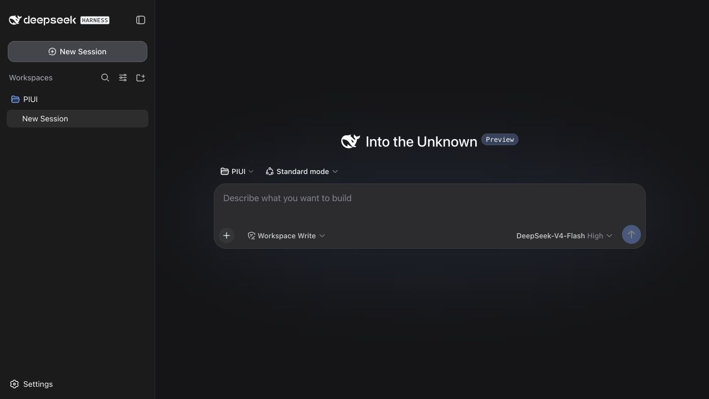
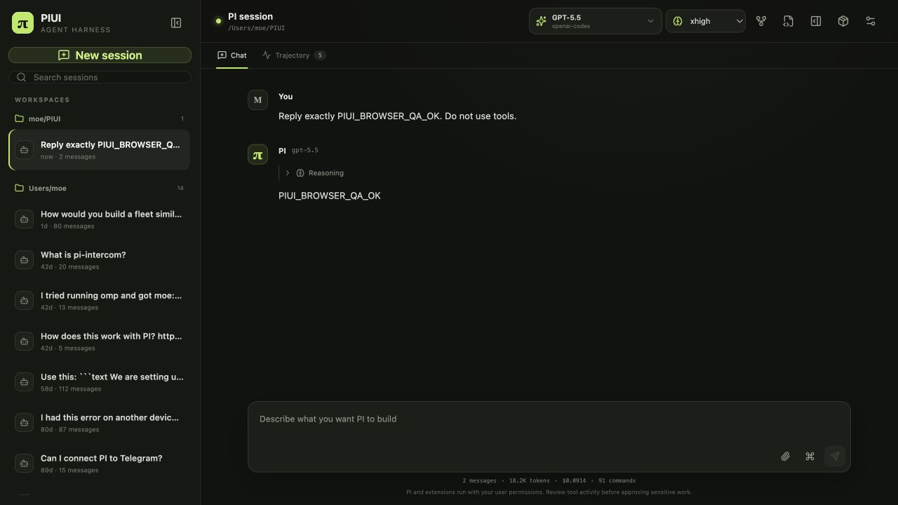
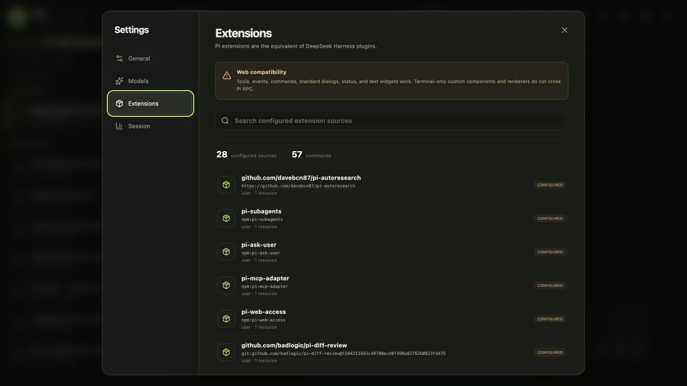
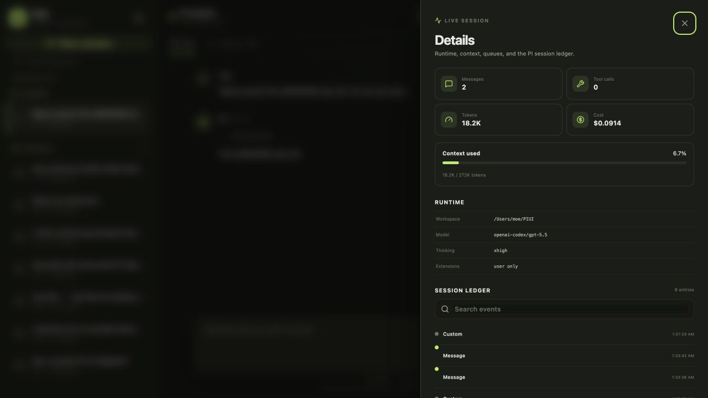
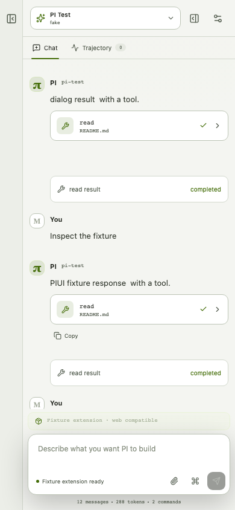

# PIUI product and functional QA

Audit date: 2026-08-14  
Reference: DeepSeek Harness `47f943859bef60e4160492346772ded9b24f765a`  
PI runtime: local 0.84.1, `openai-codex/gpt-5.5`

## Overall verdict

Healthy for the core PI harness workflow. PIUI now opens into a ready local PI process, accepts text and images, exposes the actual model catalog and thinking levels, streams native PI events, survives browser reloads, resumes saved sessions in their authoritative workspace, renders extension dialogs/status/widgets, and exposes DeepSeek-inspired settings and trajectory surfaces.

PIUI intentionally does not imitate provider-key management, sandbox permission presets, or arbitrary terminal extension components that PI RPC cannot enforce or render.

## 1. DeepSeek Harness reference flow — healthy

The reference establishes the workspace sidebar, session navigation, central conversation, visible model/reasoning controls, composer actions, settings, tool rows, and Chat/Trajectory split. These elements were used as the interaction baseline, without copying DeepSeek's Cordis implementation.

## 2. PIUI real session and composer — healthy

- The composer accepted keyboard input immediately after PI hydration.
- The searchable picker switched between real local models; model changes refreshed the supported thinking levels.
- A real authenticated PI prompt returned `PIUI_BROWSER_QA_OK` through the browser UI.
- Reload restored the transcript, selected model, commands, extension status/widgets, stats, and editable composer without duplication.
- The sidebar grouped actual PI sessions by workspace and the bottom strip exposed messages, tokens, cost, and command count.

## 3. Settings and extensions — healthy

- General, Models, Extensions, and Session settings are keyboard-focusable native dialogs.
- The real catalog showed 28 configured extension sources and 57 extension commands in this run.
- Inventory rows say `configured`, not `active`, because PI RPC cannot prove or hot-toggle every resource independently.
- The UI explicitly states which standard extension surfaces work and which terminal-only components cannot cross RPC.
- Session settings expose rename, clone, compact, export, auto-compaction, and auto-retry controls backed by PI commands.

## 4. Trajectory and session state — healthy

- Chat and Trajectory are visible session views, matching the reference's information hierarchy.
- The details surface shows messages, tool calls, token/cost totals, context use, workspace, model, thinking level, trust state, queues, and a searchable raw PI entry ledger.
- Resume uses the session header workspace as authoritative. The workspace field is read-only and the server rejects mismatches before spawning PI.

## 5. Responsive workflow — healthy

- The 390 × 844 flow kept model selection, Chat/Trajectory, messages, tool expansion, composer, attachments, commands, and settings usable without document overflow.
- The sidebar becomes a modal drawer with a scrim; the rest of the interface is inert while native dialogs are open.
- Automated accessibility checks reported no serious or critical Axe violations on the settled desktop or mobile shells.

## Resolved high-impact findings

1. Composer and model controls no longer depend on a hidden manual start step; PI starts safely and controls remain unavailable only until real hydration completes.
2. Reload/reconnect now replays cached PI state, messages, model catalogs, thinking levels, commands, stats, entries, and extension UI state.
3. Diagnostics no longer replace the running state or disable the composer.
4. Starting a new runtime clears stale messages, dialogs, catalogs, queues, status, widgets, and editor injection.
5. Session resume cannot display one workspace while PI tools operate in another.
6. `index.html` no longer appears blank when opened directly; it explains that the local server must be started with `Start PIUI.command`.
7. Light-theme contrast and mobile visibility defects found during browser QA were corrected and added to regression coverage.

## Automated verification

- TypeScript server and web checks
- 10 deterministic unit/integration tests
- 4 browser E2E flows across desktop and mobile
- Serious/critical Axe checks on desktop and mobile
- Production Vite build
- Real PI RPC smoke against the installed 0.84.1 runtime
- Real browser prompt, model switch, reload hydration, session resume, extension inventory, and trajectory checks

## Evidence limits

- Automated accessibility checks do not replace screen-reader and full keyboard-only testing.
- One real model prompt was used for acceptance; provider-specific failure and rate-limit states were not forced.
- Arbitrary PI TUI custom components, headers, footers, themes, raw terminal input, and custom renderers cannot be rendered through PI's documented RPC protocol.
- The in-app browser security policy blocks `file://` navigation, so the direct-file guidance was verified from the shipped static markup rather than through browser automation. The functional product was tested over its required loopback server.
